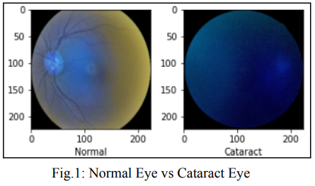
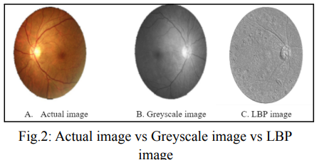
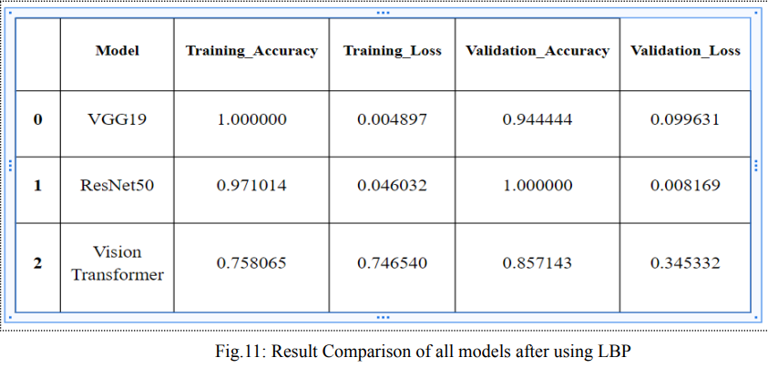

# Ocular Disease Detection using Deep Learning
## Overview
The Ocular Disease Detection project aims to automate the diagnosis of various eye diseases using deep learning techniques. The project utilizes the ODIR dataset, which includes fundus images of patients with Diabetes, Glaucoma, Cataract, Related Macular Degeneration, Myopia, Hypertensive Retinopathy, and other eye conditions. The objective is to build a robust and accurate system for identifying ocular diseases from fundus images.

## Dataset
The ODIR dataset contains 6000 fundus images, each categorized into one of the mentioned eye disease classes. However, the dataset might suffer from class imbalances, which can affect the performance of the models.

## Image Processing
To extract useful texture information from the fundus images, Local Binary Pattern (LBP) is applied as a preprocessing step. LBP is a powerful texture descriptor that helps capture significant patterns and features from the images, improving the performance of the models.

## Deep Learning Models
Three different deep learning models are utilized for ocular disease recognition:

1. VGG-19: A popular and deep convolutional neural network architecture known for its ability to learn intricate features from images. VGG-19 has shown great success in various image recognition tasks.

2. ResNet-50: Residual Network is another widely used deep learning architecture that addresses the vanishing gradient problem, allowing for the training of very deep networks. ResNet-50 has demonstrated excellent performance in image classification tasks.

3. Vision Transformer: The Vision Transformer is a recent breakthrough in computer vision, showing remarkable results in various image-related challenges. It employs a self-attention mechanism to capture global information from the images.

## Training and Evaluation
The models are trained on the preprocessed images using LBP and validated using appropriate evaluation metrics, such as accuracy. The dataset is split into training and testing sets to ensure the generalization of the models.

## Future Directions
The Ocular Disease Detection project could be extended in the following ways:

1. Exploring other deep learning architectures specifically designed for medical image analysis, such as U-Net or DenseNet, and comparing their performance with the existing models.
2. Utilizing data augmentation techniques to address class imbalances and further enhance the model's ability to recognize rare eye conditions.
3. Implementing an ensemble learning approach to combine the predictions of multiple models for improved accuracy and robustnes
   
## Conclusion
Ocular disease detection using deep learning models, LBP preprocessing, and vision transformer techniques shows promising results for early diagnosis and effective treatment. By utilizing state-of-the-art methodologies, this project contributes to advancing the field of medical image analysis and has the potential to assist clinicians in providing timely and accurate diagnoses to patients with various ocular diseases.

## Other Contributors
1. <a href='https://github.com/rajeev102001'>Rajeev Ranjan</a>
2. <a href='https://github.com/kshitij9876'>Kshitij Kumar</a>
